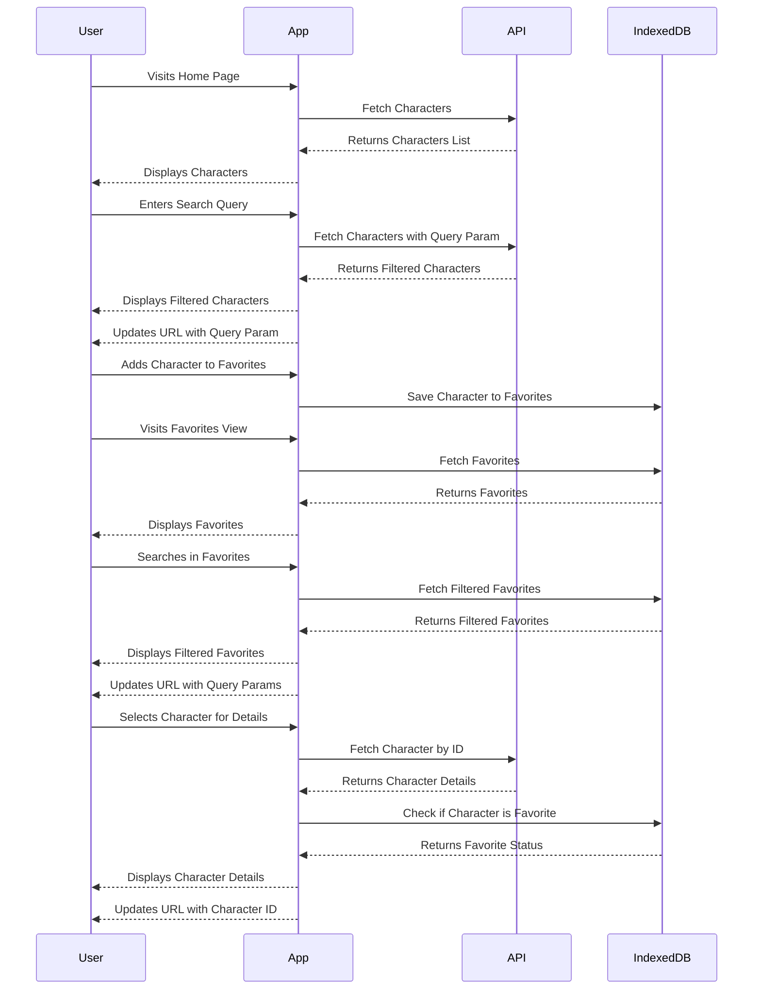

# Zara Web Challenge

This application allows users to:

- Search Dragonball characters
- Add/remove them from favorites
- Visit the favorite list persisted in the browser
- View the details of each character

## Table of Contents

- [Getting Started](#getting-started)
- [Running the Application](#installation)
- [Testing](#testing)
- [Linting and Formatting](#linting-and-formatting)
- [Architecture](#architecture)

## Getting Started

### Prerequisites

To run the project locally, you'll need:

- [Node.js](https://nodejs.org/) (version >= 18)
- [pnpm](https://pnpm.io/) (or you can use npm/yarn, but pnpm is recommended)

### Installation

1. Clone the repository:
   ```sh
   git clone https://github.com/Mahx82/zara-web-challenge.git
   ```
2. Navigate to the project directory:
   ```sh
   cd zara-web-challenge
   ```
3. Install dependencies:
   ```sh
   pnpm install
   ```

## Running the Application

To start the development server, run:

```sh
pnpm dev
```

Open [http://localhost:5173](http://localhost:5173) to view it in the browser.

To create a production build of the application, use the following command:

```sh
pnpm build
```

To check the preview, run:

```sh
pnpm preview
```

Open [http://localhost:4173](http://localhost:4173) to view it in the browser.

## Testing

### Unit testing

The project uses Vitest and React Testing Library for unit testing. To run the tests:

```sh
pnpm test
```

### e2e testing

The project uses Cypress for e2e testing. To run the tests:

To start the development server, run:

```sh
pnpm dev
```

To open e2e tests:

```sh
pnpm cy:open
```

To run e2e tests:

```sh
pnpm cy:run
```

## Linting and Formatting

To run ESLint and analyze the code, use the following command:

```sh
pnpm lint
```

To run Prettier and format the code, use the following command:

```sh
pnpm format
```

Thanks to the VSCode configuration and the recommended extensions, you don't have to worry about linting and formatting manually. The code will be automatically linted and formatted on save.

For a better development experience, it is recommended to use the following VSCode extensions, which are defined in the .vscode/extensions.json file:

```sh
{
  "recommendations": [
    "dbaeumer.vscode-eslint",
    "esbenp.prettier-vscode",
  ]
}
```

### Husky for Pre-commit Hooks

To ensure that your code is linted and formatted before each commit, Husky will do the work automatically with a pre-commit hook, so you will be warn if Husky cannot fix all errors.

## Architecture

The application follows a component-based architecture. Here are the main parts:

```
zara-web-challenge/
├── src/
│   ├── assets/          # Static assets like images, fonts, etc.
│   ├── components/      # Reusable UI components
│   │   ├── character-details/  # Components related to character details view
│   │   ├── home/               # Components related to home view
│   │   ├── shared/             # Shared components used across different views
│   ├── contexts/        # React context providers for global state management
│   ├── hooks/           # Custom hooks for encapsulating reusable logic
│   ├── layout/          # Layout components that define the structure of the application
│   ├── pages/           # Top-level components representing different views/pages
│   ├── services/        # Modules for API calls and data types
│   │   ├── api/         # API service modules for making HTTP requests
│   │   ├── db/          # Modules for interacting with IndexedDB
```

### Data flow

The diagram below illustrates how data flows through the application.


